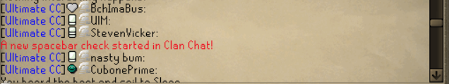
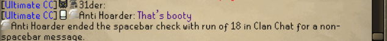
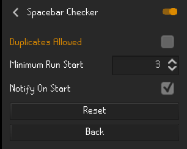

# Spacebar Checker

Spacebar checks are a fun chat game that people play when chat hits a lul.
This plugin counts consecutive spacebar messages in chats to easily count spacebar check highscores.
The plugin can even notify you when a spacebar check starts, so you never miss another one!

## Example

## Settings

